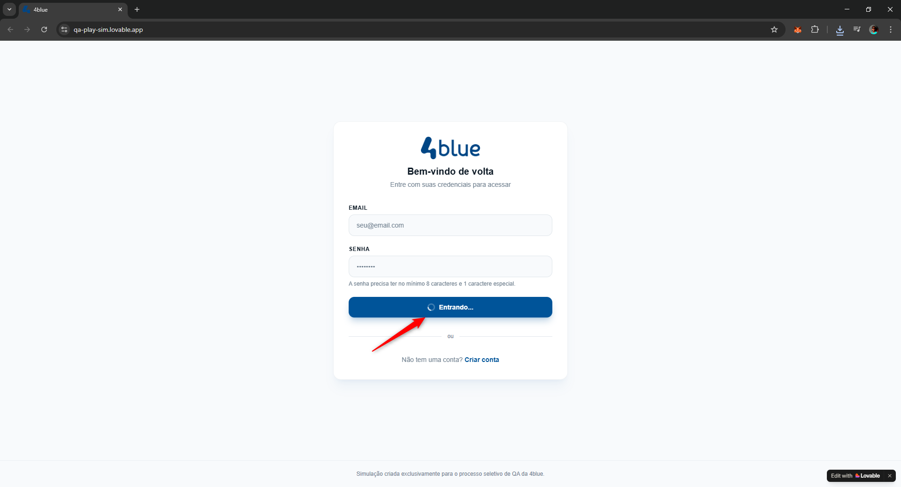
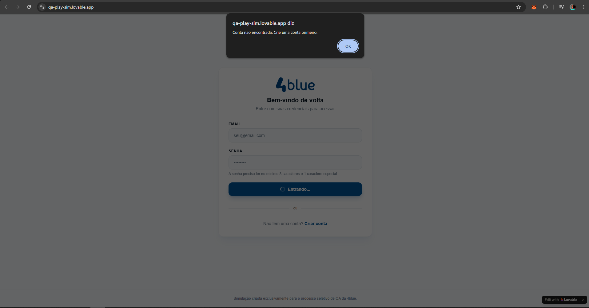

# Teste Técnico – QA Tester | 4blue

Autor: Kaique Barreto Santos  
Cargo pretendido: Analista de Testes / QA Jr  

---

# Sistema analisado

https://qa-play-sim.lovable.app/

---

# Objetivo

Realizar uma análise exploratória do sistema com o objetivo de identificar:

- Bugs funcionais
- Problemas de experiência do usuário (UX)
- Falhas de validação de dados
- Inconsistências nas regras de negócio
- Possíveis problemas de segurança básica

---

# Metodologia de Teste

Os testes foram realizados utilizando **abordagem exploratória**, analisando principalmente os seguintes fluxos:

- Login
- Criação de conta
- Validação de campos
- Comportamento do sistema em cenários inválidos
- Consistência das mensagens exibidas ao usuário

Durante a análise foram realizados diversos cenários variando os dados de entrada e observando o comportamento da aplicação.

---

# Bugs Encontrados

---

## Bug 1 – Botão de login permite envio com campos vazios

### Descrição

Na tela de login, o botão **Entrar** permanece habilitado mesmo sem o preenchimento dos campos de email e senha, permitindo o envio do formulário sem qualquer validação prévia.

### Passos para reproduzir

1. Acessar a tela de login.
2. Não preencher os campos de email e senha.
3. Clicar no botão **Entrar**.

### Resultado atual

O sistema tenta processar o login, exibindo o status **"Entrando..."** e posteriormente apresenta a mensagem:

"Conta não encontrada. Crie uma conta primeiro."

### Resultado esperado

O sistema deveria impedir o envio do formulário e apresentar mensagens de validação informando que os campos **email** e **senha** são obrigatórios.

### Severidade

Médio

### Prioridade

Alta

---

## Bug 2 – Mensagem incorreta ao informar senha inválida

### Descrição

Ao tentar realizar login utilizando um email válido e uma senha incorreta, o sistema apresenta uma mensagem informando que a conta não foi encontrada.

### Passos para reproduzir

1. Acessar a tela de login.
2. Informar um email válido existente.
3. Informar uma senha incorreta.
4. Clicar em **Entrar**.

### Resultado atual

O sistema apresenta a mensagem:

"Conta não encontrada. Crie uma conta primeiro."

### Resultado esperado

O sistema deveria apresentar uma mensagem mais adequada ao erro, como por exemplo:

"Email ou senha inválidos."

### Severidade

Baixo

### Prioridade

Média

---

## Bug 3 – Mensagem de erro exibida após login realizado com sucesso

### Descrição

Após realizar login com credenciais válidas, o sistema apresenta simultaneamente uma mensagem de erro inesperado, mesmo exibindo a tela de sucesso.

### Passos para reproduzir

1. Criar uma conta válida.
2. Realizar login utilizando email e senha corretos.

### Resultado atual

O sistema redireciona corretamente para a tela contendo a mensagem:

"Login realizado com sucesso. Você foi autenticado e já pode utilizar o sistema."

Entretanto, também é exibido um **balão com a mensagem "Erro inesperado"**.

### Resultado esperado

Após login realizado com sucesso, nenhuma mensagem de erro deveria ser exibida.

### Severidade

Alto

### Prioridade

Alta

### Evidência em vídeo

[Assistir vídeo do erro após login](BG3_Mensagem_de_erro_exibida_após_login_realizado_com_sucesso_06.03.2026.mp4)

---

## Bug 4 – Problemas de layout na tela de criação de conta

### Descrição

Na tela de criação de conta foram identificados problemas de layout onde alguns campos aparecem desalinhados e ultrapassam a área delimitada do formulário.

### Passos para reproduzir

1. Acessar a tela **Criar Conta**.
2. Observar a disposição dos campos do formulário.

### Resultado atual

Os campos **Nome completo** e **Telefone** aparecem desalinhados visualmente, aparentando sobreposição.  
Além disso, o campo **Telefone** ultrapassa a área do formulário.

O mesmo comportamento ocorre com os campos **Senha** e **Confirmar senha**.

### Resultado esperado

Os campos deveriam permanecer corretamente alinhados dentro da área do formulário.

### Severidade

Baixo

### Prioridade

Baixa

---

## Bug 5 – Sistema permite criação de conta sem preenchimento de dados

### Descrição

O sistema permite criar uma conta mesmo sem preencher nenhum campo do formulário.

### Passos para reproduzir

1. Acessar a tela **Criar Conta**.
2. Não preencher nenhum campo.
3. Clicar em **Criar conta**.

### Resultado atual

O sistema cria a conta com sucesso e apresenta a mensagem:

"Conta criada com sucesso. Sua conta foi criada. Você já pode acessar a plataforma."

Além disso, após essa ação foi possível acessar o sistema sem informar credenciais.

### Resultado esperado

O sistema deveria validar os campos obrigatórios e impedir a criação da conta sem o preenchimento das informações.

### Severidade

Crítico

### Prioridade

Alta

---

## Bug 6 – Sistema permite criação de conta com campos obrigatórios não preenchidos

### Descrição

Durante os testes foi identificado que o sistema permite criar contas mesmo quando campos obrigatórios não são preenchidos.

### Passos para reproduzir

1. Acessar a tela **Criar Conta**.
2. Preencher parcialmente o formulário.
3. Deixar um ou mais campos obrigatórios vazios (ex: Nome, Telefone, Email ou Senha).
4. Clicar em **Criar conta**.

### Resultado atual

A conta é criada com sucesso mesmo com campos obrigatórios não preenchidos.

### Resultado esperado

O sistema deveria validar todos os campos obrigatórios antes de permitir a criação da conta.

### Severidade

Crítico

### Prioridade

Alta

---

## Bug 7 – Falha de validação dos formatos dos campos

### Descrição

O sistema não realiza validação adequada dos dados inseridos nos campos do formulário de criação de conta.

### Passos para reproduzir

1. Acessar a tela **Criar Conta**.
2. Inserir dados inválidos nos campos, como:

- números no campo **Nome**
- letras no campo **Telefone**
- email em formato inválido
- senha contendo apenas letras ou apenas números

3. Clicar em **Criar conta**.

### Resultado atual

O sistema permite a criação da conta mesmo com dados inválidos.

Além disso, abaixo do campo de senha existe a mensagem:

"A senha precisa ter no mínimo 8 caracteres e 1 caractere especial."

Mesmo assim, a conta é criada sem respeitar essa regra.

### Resultado esperado

O sistema deveria validar os formatos dos campos e impedir o cadastro caso os requisitos não sejam atendidos.

### Severidade

Alto

### Prioridade

Alta

---

# Priorização de Correção

Os dois bugs que eu corrigiria primeiro seriam:

### 1 – Criação de conta sem preenchimento de dados

Esse problema compromete diretamente a integridade do sistema, permitindo a criação de contas inválidas e acesso sem credenciais.

### 2 – Falha de validação dos campos no cadastro

A ausência de validação permite que dados inconsistentes sejam armazenados no sistema e não respeita as regras informadas ao usuário.

---

# Sugestões de melhoria

- Implementar validações obrigatórias nos campos do formulário.
- Validar corretamente o formato de email.
- Validar formato de telefone.
- Aplicar corretamente as regras de senha informadas ao usuário.
- Melhorar mensagens de erro para tornar o feedback mais claro.
- Corrigir problemas de layout na tela de cadastro.
- Implementar validações tanto no **front-end** quanto no **back-end**.

---

# Considerações Finais

Durante a análise foi possível identificar diversas falhas relacionadas principalmente à ausência de validação de dados e inconsistências no fluxo de autenticação.

Grande parte dos problemas encontrados poderia ser evitada com a implementação de validações adequadas tanto no front-end quanto no back-end, além da definição clara das regras de negócio.

A realização de testes exploratórios demonstrou ser eficaz para identificar rapidamente falhas críticas que impactam diretamente a integridade do sistema e a experiência do usuário.